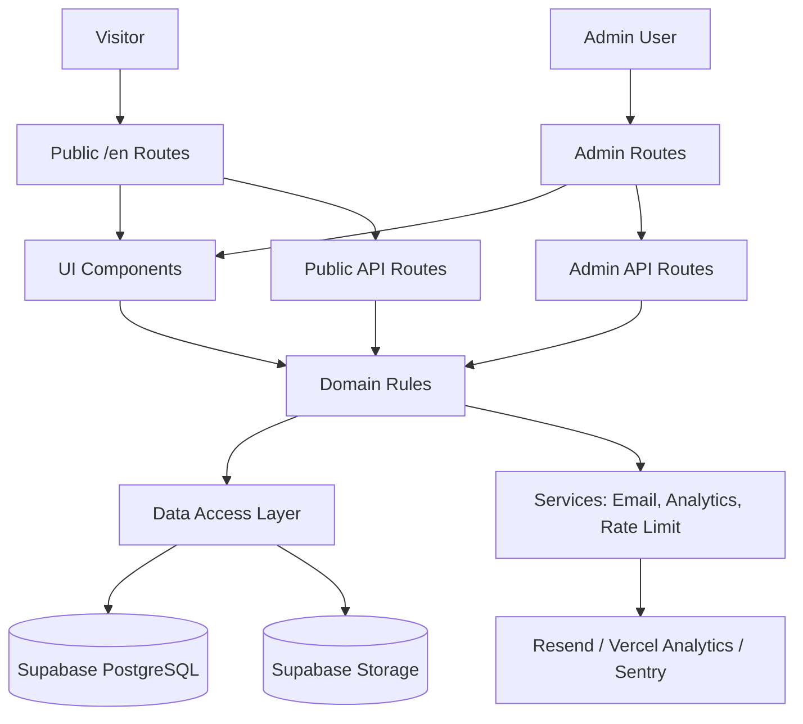
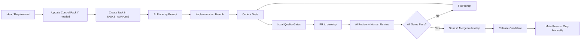

# AURA — Optimized Project Control Pack
## Premium Interactive Real Estate Website Engine

**Version:** v1.4 Mandatory Patches Applied (P-01–P-06) — Awaiting Opus 4.8 Ratification  
**Status:** NEEDS_PATCH resolved — Awaiting Opus 4.8 ratification before TASKS_AURA.md authorization  
**Project / Engine Name:** AURA  
**Flagship Demo Brand:** AUTEX Estates Dubai  
**Primary Market:** Dubai Real Estate  
**Primary Customer:** Mid-size real estate agencies  
**MVP Start Mode:** From zero / greenfield repository  
**Delivery Model:** One-time project delivery + optional support/maintenance  
**Deployment Model:** Separate deployment per real client  
**MVP Language:** English visible UI  
**Architecture Requirement:** i18n-ready and LTR/RTL-ready from day one  
**Primary Development Flow:** ChatGPT / Claude / Antigravity-assisted coding with strict quality gates

---

## 0. Purpose of This Pack

This document is the single source of truth for building AURA from zero.

It is optimized for:

1. external AI review before task creation;
2. creation of `TASKS_AURA.md`;
3. implementation by AI coding agents such as Antigravity / Claude Code / Cursor;
4. GitHub PR review and merge gating;
5. preventing scope drift, architecture drift, security regressions, and low-quality AI-generated code.

This pack replaces fragmented planning notes. Do not create implementation tasks or write code until this pack receives one of these review verdicts:

- `READY_FOR_TASKS`
- `NEEDS_PATCH`
- `BLOCKED`

If `READY_FOR_TASKS`, create `TASKS_AURA.md`.  
If `NEEDS_PATCH`, patch this pack first.  
If `BLOCKED`, resolve the P0 contradiction before any task breakdown.


### 0.1 v1.3 Patch Summary

v1.3 adds the CTO/CPO/System Design/UI patch required before `TASKS_AURA.md` creation.

This version adds or clarifies:

- commercial package definition and clear non-included/add-on boundaries;
- canonical real estate taxonomy: `publish_status`, `transaction_type`, `market_type`, `property_type`, and `availability_status`;
- Dubai real estate MVP field contract;
- lead status/source/priority enums;
- audit log table and audit-required actions;
- table-based MVP rate limiting with future Upstash/Vercel KV path;
- first `super_admin` bootstrap flow;
- client deployment factory workflow;
- demo noindex / real-client index policy;
- image/floorplan-only MVP media policy;
- UI/UX interaction standard, design states, and admin UX rules;
- client legal readiness checklist;
- stricter task-level AI coding constraints.

### 0.2 v1.4 Patch Summary (P-01–P-06)

v1.4 applies six mandatory patches identified in the Opus 4.8 review handoff (OPUS_REVIEW_HANDOFF.md §3).

This version adds or clarifies:

- **P-01** — taxonomy drift fix: §7.4 item 5 corrected from "property status" to `availability_status` / `market_type` labels; §7.5 off-plan trigger corrected from `status = off_plan` to `market_type = off_plan` (D-36 self-violation removed);
- **P-02** — rate-limit key strategy: D-51 added; §13.3 expanded with `rate_limits` table, salted-hash key, 24-hour TTL, and scheduled cleanup; consistent with D-18 and security merge blockers;
- **P-03** — media storage posture: §12.4 documents recommended posture (public-read bucket + UUID paths + RLS-guarded writes); §12.2 footnote added for CDN revocation limitation;
- **P-04** — indexing/uniqueness contract: §11.12 added covering unique constraints, composite indexes, FK indexes, and generated `title_en` column;
- **P-05** — ambiguity fixes: §11.9 settings expanded to key-value + allowlist + per-key Zod; `preferred_contact_method` enum clarified to `phone / whatsapp / email`; `leads.status` explicitly typed by `lead_status` enum (D-37);
- **P-06** — governance: §2.7 adds "about page" to base package; §9.2.1 adds client fork no-upstream-sync note; §42 adds pack decomposition map, TASKS_AURA.md naming alias, skills gate staging rule, and client fork policy; locked decision references updated from D-50 to D-51.

---

## 1. Core Operating Rule

AURA is not a generic SaaS product. AURA is a reusable private real estate website engine used to deliver separate premium websites for real estate clients.

Every AI agent must enforce this rule before planning, coding, reviewing, or merging.

### Hard Rule

No task is complete until it passes:

- product scope gate;
- architecture boundary gate;
- security/data gate;
- test/QA gate;
- real estate UX gate when UI is affected;
- GitHub PR/merge gate before merge.

---

## 2. Product Contract

### 2.1 One-Liner

AURA is a premium interactive real estate website engine for Dubai real estate agencies, designed to create separate high-conversion client websites with property showcase, lead capture, WhatsApp-first conversion, admin management, legal pages, and performance-safe cinematic presentation.

### 2.2 Problem

Many real estate agency websites look generic, perform poorly, fail to build trust, and do not convert qualified visitors into inquiries or WhatsApp conversations. Agencies also need a manageable admin layer for properties, leads, settings, legal content, and sales demo presentation.

### 2.3 Target Users

Primary:

- real estate agency owner;
- agency marketing manager;
- agency admin managing properties and leads;
- buyer/renter/investor browsing properties.

Secondary:

- luxury brokers;
- small/new agencies needing premium credibility;
- agencies representing off-plan/developer projects.

### 2.4 Business Goal

Create a reusable engine that can be sold as a one-time premium website delivery package, with optional support and maintenance revenue.

### 2.5 Technical Goal

Build a clean, secure, testable, AI-maintainable Next.js + Supabase codebase with strict architecture boundaries and deployment isolation per real estate client.

### 2.6 Release Goal

Ship a polished flagship demo website for the fictional brand **AUTEX Estates Dubai**, then use the engine to create separate client deployments.

### 2.7 AURA Commercial Package Definition

AURA must be productized as a sellable delivery package, not as an undefined custom development project.

Default package name:

```txt
AURA Signature Real Estate Website
```

Included in the base package:

- premium public real estate website;
- homepage, listing, property detail, areas, about, contact, privacy, and terms pages;
- admin property management;
- property media gallery;
- lead capture and lead management;
- WhatsApp CTA routing and non-PII click tracking;
- editable contact/footer/SEO/trust settings;
- versioned legal pages;
- AUTEX-style sales demo capability where enabled;
- basic SEO and performance setup;
- separate Vercel/Supabase/client deployment setup;
- handover documentation.

Explicitly not included in the base MVP package:

- SaaS billing or subscriptions;
- client portal for monthly support;
- CRM integration;
- property portal sync;
- WhatsApp Business API automation;
- final Arabic UI;
- blog/insights;
- advanced analytics;
- full Google Maps integration;
- video/virtual-tour upload pipeline;
- automated property import.

Optional future add-ons:

- monthly support and maintenance;
- Arabic UI and full RTL QA;
- CRM/portal integrations;
- blog/insights module;
- advanced analytics and reporting;
- content/data migration service;
- property upload service;
- advanced SEO package;
- custom theme variants.

---

## 3. Product Identity and Brand Architecture

### 3.1 AURA

AURA is:

- the reusable real estate website engine;
- the internal productized delivery system;
- the core technical platform;
- the agency-side framework for creating separate client websites.

AURA is not:

- a full multi-tenant SaaS;
- a property portal;
- a CRM;
- a template marketplace;
- a generic website builder;
- a WhatsApp automation platform;
- a billing/subscription platform.

### 3.2 AUTEX Estates Dubai

AUTEX Estates Dubai is the fictional flagship demo brand created with AURA.

Purpose:

- demonstrate premium client output;
- make the demo feel commercially real;
- prove value to real estate agencies;
- separate engine identity from demo brand identity.

### 3.3 Fake Data and Demo Safety Policy

AUTEX is fictional and must never imply a real licensed brokerage unless legally verified.

Required rules:

- demo leads must be fake/test data only;
- demo RERA/reference/license numbers must be clearly fake and must not mimic real claims;
- demo images must be license-safe or generated/owned assets;
- demo mode pages must not be indexed;
- no legal/commercial claim may imply AUTEX is an operating real estate business;
- no production client private data may be used in demo mode;
- demo admin accounts must never be reused for production.

### 3.4 Demo Indexing and Legal Disclosure Policy

AUTEX demo deployment policy:

- public viewing is allowed for demos and sales presentations;
- indexing is disabled by default using robots/meta noindex;
- demo/sales pages must not be submitted to search engines;
- footer or legal content must make clear that AUTEX is a fictional demonstration brand when deployed as a public demo;
- no verified brokerage, RERA, ORN, BRN, or trade-license claim may be displayed unless legally true and client-approved.

Real client production policy:

- indexing may be enabled only after client approval;
- legal pages, contact information, license numbers, images, and property data must be client-provided or client-approved;
- production client data must never be copied into AUTEX/demo environments.

---

## 4. Locked Decisions

Locked decisions are final unless explicitly changed through change control. v1.3 extends the lock set to D-50.

| ID | Decision | Rule |
|---|---|---|
| D-01 | Product identity | AURA is the engine/product name. |
| D-02 | Demo brand | AUTEX Estates Dubai is fictional and demo-only. |
| D-03 | Product model | Reusable private real estate website engine, not SaaS MVP. |
| D-04 | Deployment model | Separate Vercel, Supabase, domain, env vars, DB, storage, and admins per client. |
| D-05 | No multi-tenant MVP | No `clients` table, no `client_id`, no shared production DB. |
| D-06 | Route strategy | MVP public routes use `/en/...`; `/` redirects to `/en`. |
| D-07 | Arabic/RTL | Arabic UI is Phase 2; MVP is English visible UI but RTL-ready. |
| D-08 | i18n content | Property, area, and legal translatable fields use JSONB/i18n-ready structures. |
| D-09 | Bedrooms | `bedrooms` is nullable for `office` and `plot`; validation depends on type. |
| D-10 | Legal pages | Privacy Policy and Terms are in MVP with versioning and statuses. |
| D-11 | Legal acceptance | User acceptance tracking is out of MVP; lead forms link to active Privacy Policy. |
| D-12 | Legal safety | Use Markdown or controlled rich text; raw unrestricted HTML is banned. |
| D-13 | Property contact override | Property may define agent/contact override fields. |
| D-14 | Contact routing | Property override → agency contact → never stakeholder auto-routing. |
| D-15 | Stakeholders | Properties may have internal stakeholders: developer, owner, seller, landlord, sales partner, exclusive agent. |
| D-16 | Stakeholder visibility | Internal-only by default; public visibility must be explicit. |
| D-17 | WhatsApp tracking | Lightweight WhatsApp click tracking is in MVP. |
| D-18 | WhatsApp privacy | No IP, phone, email, or personal data in `whatsapp_clicks` by default. |
| D-19 | Sales Demo Mode | Enabled only by config and `?demo=sales`; off by default for real clients. |
| D-20 | Admin editable content | Admin can edit operational content, contact, footer, legal, trust fields, and SEO basics. |
| D-21 | Admin boundaries | Admin cannot edit core layout, design system architecture, motion system, or component behavior. |
| D-22 | Areas Admin | Simple add/edit/deactivate only in MVP. |
| D-23 | Delivery model | One-time delivery; optional monthly support. |
| D-24 | Core/client repos | Both core and client repos must preserve CI/security gates. |
| D-25 | Design system | Token-based design system; flagship theme is `luxury-dark`. |
| D-26 | Motion strategy | Heavy motion only for homepage/storytelling; reduced motion required. |
| D-27 | Performance targets | Desktop PageSpeed >90, cinematic mobile MVP >75, production mobile target >80, CLS <0.1. |
| D-28 | Testing/gates | No task is done unless required gates pass. |
| D-29 | Start mode | Project starts from zero in a new greenfield repo. |
| D-30 | MVP roles | Only `super_admin` and `client_admin` in MVP. Future roles go to Roadmap Parking Lot. |
| D-31 | Lead delete | MVP uses soft delete/archive; hard delete only outside normal UI. |
| D-32 | Property delete | Use `draft / published / archived`; real delete is not normal MVP behavior. |
| D-33 | Fake data | AUTEX demo data must be license-safe, non-indexed, non-real, and non-PII. |
| D-34 | API spec | MVP endpoints require explicit auth, authorization, validation, errors, rate limits, logging, and tests. |
| D-35 | Production readiness | Environment, observability, privacy, data lifecycle, backup, incident, cost, analytics, support, and release checks are required. |
| D-36 | Property taxonomy | Never overload `status`; use `publish_status`, `transaction_type`, `market_type`, `property_type`, and `availability_status`. |
| D-37 | Lead enums | Use explicit `lead_status`, `lead_source`, and optional `lead_priority`; no free-form lead lifecycle values. |
| D-38 | Audit logs | Admin state changes, lead export, legal publish, settings update, and property publish/archive require audit logging where practical. |
| D-39 | Rate limiting | MVP uses simple server-side/table-based rate limiting; future high-traffic deployments may switch to Upstash/Vercel KV. |
| D-40 | Admin bootstrap | No public admin self-signup; first `super_admin` is created manually through Supabase Auth plus a seed/admin script. |
| D-41 | MVP media scope | MVP supports images and optional floorplan images only; video/360/virtual tour upload is out of MVP. |
| D-42 | SEO indexing policy | AUTEX demo is noindex by default; real-client indexing requires approval and config. |
| D-43 | Client deployment factory | Every real client must be created from the core template into an isolated repo/deployment/Supabase project. |
| D-44 | UI state coverage | Every data-driven UI must define loading, empty, error, success, unauthorized, forbidden, validation, and retry states. |
| D-45 | AI task constraints | Every implementation task must list allowed files, forbidden files, required tests, screenshots for UI tasks, architecture checks, security checks, and rollback notes when migrations are involved. |
| D-46 | Settings/content governance | Settings changes are immediate but validated and audit-logged; legal pages use draft → publish; design architecture cannot be changed from admin. |
| D-47 | Reference numbers | Property `reference_number` is auto-generated by default with optional admin override; uniqueness is mandatory. |
| D-48 | Price visibility | `price_visibility` must support `visible` and `price_on_application`. |
| D-49 | Map scope | MVP uses text location and optional external map link/static placeholder; full embedded Google Maps is out of MVP. |
| D-50 | Client legal readiness | Real-client production release requires legal/contact/license/image/property-data approval before indexable launch. |
| D-51 | Rate-limit key strategy | Rate-limit keys use `salted-hash(IP + route)` computed server-side; raw IP is never stored in `rate_limits` or any event/analytics table; the hash salt is a server-only secret env variable; the dedicated `rate_limits` table (key_hash, route, count, window_start, expires_at) uses a 24-hour TTL with scheduled cleanup. Consistent with D-18 (no raw IP in event tables) and the security merge blocker against IP in `whatsapp_clicks`. |

---

## 5. MVP Scope

### 5.1 Included in MVP

AURA MVP includes:

1. greenfield repo setup;
2. reusable Core Engine;
3. AUTEX Estates Dubai flagship demo;
4. public real estate website;
5. admin panel;
6. Supabase Auth;
7. `super_admin` and `client_admin` roles;
8. first-admin bootstrap flow;
9. property CRUD;
10. duplicate property;
11. property publish workflow using `publish_status: draft / published / archived`;
12. canonical property taxonomy with `transaction_type`, `market_type`, `property_type`, `availability_status`;
13. property media upload/gallery for images and floorplan images only;
14. property listing and filtering;
15. property detail page;
16. property contact override;
17. optional internal stakeholders;
18. lead capture;
19. lead management;
20. lead search;
21. lead archive/soft-delete;
22. lead export with audit logging;
23. email notification for every new lead;
24. basic dashboard with lead/source/WhatsApp/property metrics;
25. WhatsApp click tracking without PII;
26. table-based MVP rate limiting for public write endpoints;
27. settings management;
28. admin-editable contact/footer/communication settings;
29. versioned legal pages;
30. English visible UI;
31. `/en/...` routes;
32. i18n-ready data and routing architecture;
33. LTR/RTL-ready design architecture;
34. premium interactive homepage;
35. areas overview page;
36. simple Areas Admin;
37. Sales Demo Mode;
38. SEO basics with AUTEX noindex by default;
39. performance-safe animation strategy;
40. separate deployment support;
41. client deployment factory workflow;
42. manual property entry;
43. managed migration service as an agency-side onboarding process;
44. UI loading/empty/error/forbidden/validation states;
45. audit logs for sensitive admin actions;
46. client legal readiness checklist for real production.

### 5.2 Explicitly Out of Scope for MVP

Do not include:

- multi-tenant SaaS;
- `clients` table;
- `client_id` model;
- shared production DB across clients;
- tenant routing;
- cross-client admin;
- SaaS billing/subscription;
- customer maintenance portal;
- CRM integration;
- Property Finder/Bayut/Dubizzle sync;
- WhatsApp Business API automation;
- Google Maps full integration;
- full embedded Google Maps integration;
- Blog/Insights;
- advanced analytics dashboard;
- Arabic final UI;
- full RTL QA;
- virtual tour/360;
- native property video upload;
- bulk admin actions;
- public indexing of fictional AUTEX demo;
- payment gateway;
- mobile app;
- AI chatbot;
- multiple demo websites;
- advanced roles such as editor/agent/viewer/support;
- real-time chat;
- CSV property import;
- portal/CRM property sync;
- full Area Landing Page CMS.

### 5.3 Roadmap Parking Lot

These are intentionally parked for later:

- Arabic UI and full RTL QA;
- CSV import;
- CRM integration;
- WhatsApp Business API;
- Google Maps full integration;
- full embedded Google Maps integration;
- area landing page CMS;
- blog/insights;
- advanced analytics;
- editor/agent/viewer/support roles;
- agent routing rules;
- portal sync;
- billing/subscription;
- customer maintenance portal;
- additional demo templates.

---

## 6. User Roles and Permissions

### 6.1 MVP Roles

| Role | Purpose | MVP Access |
|---|---|---|
| `super_admin` | Agency/internal owner | Full admin access, user/admin management, destructive operations outside normal UI. |
| `client_admin` | Client/admin user | Manage properties, leads, settings, legal pages, areas, dashboard. |

### 6.2 Non-MVP Roles

The following roles must not be implemented in MVP:

- `editor`;
- `agent`;
- `viewer`;
- `support`.

They may be documented only in Roadmap Parking Lot.

### 6.3 Admin Access Rule

Authentication alone is not enough. Admin access requires:

1. valid Supabase session;
2. matching row in `user_profiles`;
3. role in `super_admin` or `client_admin`;
4. route/API authorization check;
5. RLS policy compliance.

---

## 7. Public Website Requirements

### 7.1 Public Routes

| Route | Purpose |
|---|---|
| `/` | Redirect to `/en`. |
| `/en` | Homepage. |
| `/en/properties` | Property listing. |
| `/en/properties/[slug]` | Property detail. |
| `/en/areas` | Areas overview. |
| `/en/about` | Agency/about page. |
| `/en/contact` | Contact page. |
| `/en/privacy` | Published Privacy Policy. |
| `/en/terms` | Published Terms & Conditions. |

### 7.2 Homepage Sections

1. Interactive Cinematic Hero
2. Featured Properties
3. Area Explorer
4. Investment / Lifestyle Path Section
5. Trust / Why This Agency Section
6. Lead CTA Section
7. Footer

Hero filters:

- Goal: Buy / Rent / Invest / Off-plan
- Area: Dubai Marina / Downtown Dubai / Palm Jumeirah / Dubai Hills / Business Bay / Any Area
- Budget: Under AED 1M / AED 1M–3M / AED 3M–7M / AED 7M+
- Optional expandable filters: bedrooms and property type

Primary CTA:

- `Explore Matching Properties`

### 7.3 Listing Page

Must include:

- property grid;
- filters by status/goal, property type, area, budget, bedrooms;
- search by reference number or keyword;
- sort: newest, price low-to-high, price high-to-low;
- pagination or load more;
- empty state;
- property detail CTA;
- WhatsApp secondary CTA;
- mobile filter drawer.

### 7.4 Property Detail Page

Must include:

1. large media gallery;
2. title;
3. price;
4. area/community;
5. availability_status and market_type labels;
6. property type;
7. key specs;
8. sticky inquiry card on desktop;
9. sticky bottom CTA on mobile;
10. description;
11. amenities;
12. location section;
13. RERA/reference/trust block;
14. off-plan block when relevant;
15. similar properties;
16. inquiry form.

### 7.5 Off-Plan Block

Show only when `market_type = off_plan`.

Optional fields:

- developer_name;
- handover_date;
- completion_percentage;
- down_payment_amount;
- payment_plan.

---

## 8. Admin Requirements

### 8.1 Admin Routes

| Route | Purpose |
|---|---|
| `/admin/login` | Login page. |
| `/admin/dashboard` | Dashboard. |
| `/admin/properties` | Property list. |
| `/admin/properties/new` | Create property. |
| `/admin/properties/[id]/edit` | Edit property. |
| `/admin/leads` | Lead management. |
| `/admin/settings` | Operational settings. |
| `/admin/legal` | Legal pages. |
| `/admin/areas` | Simple areas admin. |

### 8.2 Admin Sections

MVP admin includes:

- login/logout;
- dashboard;
- properties;
- add/edit/duplicate property;
- media management;
- leads;
- lead search;
- lead export;
- settings;
- legal pages;
- areas admin.

### 8.3 Dashboard Metrics

Dashboard shows:

- total properties;
- published properties;
- draft properties;
- archived properties;
- total leads;
- new leads;
- leads by source;
- total WhatsApp clicks;
- WhatsApp clicks by source;
- most inquired property;
- most clicked property;
- recent leads;
- recent properties.

### 8.4 Admin Editable Content

Admin can edit:

- logo;
- agency name;
- WhatsApp;
- phone;
- email;
- office address;
- social links;
- footer content;
- footer links;
- Contact Us content;
- legal pages;
- agency-level trust fields;
- SEO basics.

Admin cannot edit:

- core layout;
- motion system;
- template architecture;
- component behavior;
- section structure;
- design system architecture.

---

## 9. Technical Architecture Contract

### 9.1 Final Stack

Frontend:

- Next.js App Router;
- TypeScript strict;
- Tailwind CSS;
- shadcn/ui;
- GSAP only for homepage/storytelling;
- Framer Motion only for lightweight UI transitions;
- React Hook Form + Zod;
- Zustand for lightweight client state;
- TanStack Query where useful;
- next-intl;
- libphonenumber-js.

Backend:

- Next.js Route Handlers;
- Supabase PostgreSQL;
- Supabase Auth;
- Supabase Storage;
- Resend;
- Zod validation;
- server-only modules.

DevOps/Quality:

- Vercel;
- GitHub Actions;
- Vitest;
- Playwright;
- CodeQL;
- npm audit;
- ESLint strict;
- TypeScript strict;
- Prettier;
- Knip;
- dependency-cruiser;
- Lighthouse before release;
- Sentry;
- Vercel Analytics;
- Semgrep recommended;
- Dependabot/Renovate recommended.

### 9.2 Separate Deployment Architecture

Each real client has:

- own Vercel project;
- own Supabase project;
- own domain;
- own environment variables;
- own database;
- own storage;
- own admin users.

No shared production database across clients in MVP.

### 9.2.1 Client Deployment Factory

Every real client deployment must follow this factory workflow:

1. create a new client repo from the AURA core template;
2. create a new Supabase project;
3. create a new Vercel project;
4. configure encrypted environment variables;
5. run migrations;
6. seed settings, legal pages, areas, and optional sample properties;
7. upload client-approved logo/media/assets;
8. create the first `super_admin` and client-approved `client_admin`;
9. connect domain;
10. run full quality/release checklist;
11. complete handover documentation.

Required isolation per client:

- no shared production database;
- no shared storage bucket;
- no shared service-role key;
- no cross-client admin access;
- no `clients` or `client_id` table/column in MVP;
- client forks receive no automated upstream engine fixes after delivery; no upstream sync is provided (intentional per D-23).

### 9.3 Architecture Layers

Required greenfield repo structure:

```txt
src/
  app/
    [locale]/
      page.tsx
      properties/
      areas/
      about/
      contact/
      privacy/
      terms/
    admin/
      login/
      dashboard/
      properties/
      leads/
      settings/
      legal/
      areas/
    api/
      properties/
      areas/
      legal/
      leads/
      whatsapp-clicks/
      admin/
  components/
    ui/
    real-estate/
    marketing/
    admin/
    layout/
  config/
    client.config.ts
    feature-flags.ts
  domain/
    properties/
    leads/
    legal/
    settings/
    areas/
    whatsapp/
    audit/
  dal/
    properties.dal.ts
    leads.dal.ts
    legal.dal.ts
    settings.dal.ts
    areas.dal.ts
    whatsapp.dal.ts
    audit-logs.dal.ts
  services/
    auth/
    email/
    storage/
    analytics/
    rate-limit/
    audit/
  lib/
    supabase/
    validation/
    i18n/
    seo/
    utils/
  styles/
  types/
  tests/
```

### 9.4 Dependency Direction

Allowed direction:

```txt
app/routes → features/components → domain → dal/services → lib/config
```

Forbidden:

- DAL importing UI components;
- domain importing React/UI;
- UI components directly querying Supabase;
- client components importing service-role helpers;
- API handlers without Zod validation;
- business rules hidden inside JSX.

### 9.5 Architecture Diagram



---

## 10. Configuration Model

### 10.1 `client.config.ts`

Deployment-level and design-system-level configuration:

```ts
export const clientConfig = {
  engine: "AURA",
  demoBrand: "AUTEX Estates Dubai",
  language: {
    defaultLocale: "en",
    enabledLocales: ["en"],
    rtlReady: true,
  },
  features: {
    salesDemoMode: true,
    arabicEnabled: false,
    propertyVideoLinks: false, // out of MVP; future add-on
    offPlanBlock: true,
    whatsappClickTracking: true,
    legalPagesEditable: true,
  },
  design: {
    themeVariant: "luxury-dark",
    motionIntensity: "premium",
    templateVariant: "premium-interactive-agency",
  },
};
```

### 10.2 Database Settings

Admin-editable operational settings:

- agency_name;
- logo_url;
- whatsapp;
- phone;
- email;
- office_address;
- social_links;
- footer_content;
- footer_links;
- contact_us_content;
- seo_title;
- seo_description;
- office_registration_number;
- broker_license_number;
- years_in_market;
- verified_badge_enabled.

### 10.3 Config vs Settings Rule

Use `client.config.ts` for deployment-level and design-system-level decisions.  
Use database `settings` for operational client-editable content.  
Do not let admin settings mutate template architecture.

---

## 11. Data Model Contract

Do not create:

- `clients` table;
- `client_id` column;
- tenant isolation model;
- cross-client access model.

### 11.1 Tables

### 11.1.1 Canonical Enums and Naming Rules

Do not use one overloaded `status` field for properties. Use these separate fields:

```txt
publish_status:
  draft
  published
  archived

transaction_type:
  sale
  rent

market_type:
  ready
  off_plan

property_type:
  apartment
  villa
  townhouse
  penthouse
  office
  plot
  retail
  warehouse

availability_status:
  available
  reserved
  sold
  rented
  unavailable

price_visibility:
  visible
  price_on_application

rental_period:
  yearly
  monthly
  weekly
  daily
  null
```

UI mapping:

```txt
Buy      = transaction_type: sale
Rent     = transaction_type: rent
Off-plan = market_type: off_plan
Invest   = UI intent/filter, not a database status
```

Lead lifecycle enums:

```txt
lead_status:
  new
  contacted
  qualified
  unqualified
  won
  lost
  archived

lead_source:
  homepage
  listing
  property_detail
  contact_page
  whatsapp_cta
  sales_demo

lead_priority:
  low
  normal
  high
```

MVP tables:

- `user_profiles`;
- `properties`;
- `property_media`;
- `property_stakeholders`;
- `areas`;
- `leads`;
- `whatsapp_clicks`;
- `settings`;
- `legal_pages`;
- `audit_logs`.

### 11.2 `user_profiles`

| Field | Notes |
|---|---|
| `id` | UUID, linked to auth user. |
| `role` | `super_admin` / `client_admin`. |
| `full_name` | Text. |
| `avatar_url` | Nullable. |
| `created_at` | Timestamp. |
| `updated_at` | Timestamp. |

### 11.3 `properties`

| Field | Notes |
|---|---|
| `id` | UUID. |
| `reference_number` | Unique display/reference value; auto-generated by default with optional admin override. |
| `slug` | Unique public slug. |
| `title` | JSONB/i18n-ready; `en` required before publish. |
| `description` | JSONB/i18n-ready; `en` required before publish. |
| `price` | Numeric; nullable only when `price_visibility = price_on_application`. |
| `currency` | Default `AED`. |
| `price_visibility` | `visible / price_on_application`. |
| `transaction_type` | `sale / rent`. |
| `market_type` | `ready / off_plan`. |
| `property_type` | `apartment / villa / townhouse / penthouse / office / plot / retail / warehouse`. |
| `availability_status` | `available / reserved / sold / rented / unavailable`. |
| `rental_period` | `yearly / monthly / weekly / daily / null`; required for rent where applicable. |
| `publish_status` | `draft / published / archived`. |
| `area_id` | FK to `areas`. |
| `community` | Text/nullable; Dubai area/community label. |
| `sub_community` | Text/nullable. |
| `building_name` | Text/nullable. |
| `location_label` | Public location label. |
| `address` | Text/nullable; avoid overexposing private owner address if not needed. |
| `external_map_url` | Nullable; allowed instead of full embedded Google Maps in MVP. |
| `bedrooms` | Nullable; required only for residential property types where relevant. |
| `bathrooms` | Nullable. |
| `parking` | Nullable. |
| `size_sqft` | Numeric. |
| `size_sqm` | Numeric/derived optional. |
| `furnishing_status` | `furnished / semi_furnished / unfurnished / unknown`. |
| `amenities` | JSONB. |
| `rera_number` | Nullable/demo-safe; real production requires client/legal approval. |
| `permit_number` | Nullable/demo-safe; real production requires client/legal approval. |
| `agent_name` | Nullable contact override. |
| `agent_phone` | Nullable contact override. |
| `agent_whatsapp` | Nullable contact override. |
| `agent_email` | Nullable contact override. |
| `developer_name` | Off-plan optional. |
| `handover_date` | Off-plan optional. |
| `completion_percentage` | Off-plan optional. |
| `down_payment_amount` | Off-plan optional. |
| `payment_plan_summary` | Off-plan optional. |
| `is_featured` | Boolean. |
| `views_count` | Optional aggregate. |
| `created_by` | Nullable FK to admin user where practical. |
| `updated_by` | Nullable FK to admin user where practical. |
| `created_at` | Timestamp. |
| `updated_at` | Timestamp. |
| `published_at` | Nullable timestamp. |
| `archived_at` | Nullable timestamp. |

Publish validation must enforce:

- valid slug/reference uniqueness;
- `publish_status = published` only when required fields are complete;
- `price` present unless `price_visibility = price_on_application`;
- `rental_period` present for rental listings where public pricing cadence is needed;
- `bedrooms` required only for relevant residential types;
- at least one cover image;
- no public exposure of internal stakeholders unless explicitly public;
- off-plan fields displayed only when `market_type = off_plan`.

### 11.4 `property_media`

MVP supports image and floorplan-image media only. Native video upload, 360 media, and virtual tours are out of MVP.

| Field | Notes |
|---|---|
| `id` | UUID. |
| `property_id` | FK. |
| `url` | Public URL or signed URL depending visibility. |
| `storage_path` | Storage object path. |
| `media_type` | `image / floorplan`. |
| `order_index` | Sort order. |
| `is_cover` | Boolean. |
| `alt_text` | Required before publish. |
| `width` | Nullable. |
| `height` | Nullable. |
| `size_bytes` | Upload validation. |
| `created_at` | Timestamp. |

Upload policy:

- allowed MIME types: `image/jpeg`, `image/png`, `image/webp`;
- max upload size: 10MB per image unless changed through config;
- required generated/display variants where practical: thumbnail, card, gallery, hero;
- one cover image required before publish;
- storage paths must not expose service credentials or unsafe user-controlled traversal.

### 11.5 `property_stakeholders`

| Field | Notes |
|---|---|
| `id` | UUID. |
| `property_id` | FK. |
| `name` | Text. |
| `type` | `developer / owner / seller / landlord / sales_partner / exclusive_agent`. |
| `phone` | Nullable, internal by default. |
| `email` | Nullable, internal by default. |
| `whatsapp` | Nullable, internal by default. |
| `registration_or_license` | Nullable. |
| `internal_notes` | Nullable. |
| `visibility` | `internal_only / public`. Default `internal_only`. |
| `created_at` | Timestamp. |
| `updated_at` | Timestamp. |

### 11.6 `areas`

| Field | Notes |
|---|---|
| `id` | UUID. |
| `slug` | Unique. |
| `name` | JSONB/i18n-ready. |
| `description` | JSONB/i18n-ready. |
| `image_url` | Nullable. |
| `is_active` | Boolean. |
| `sort_order` | Integer. |
| `created_at` | Timestamp. |
| `updated_at` | Timestamp. |

### 11.7 `leads`

| Field | Notes |
|---|---|
| `id` | UUID. |
| `property_id` | Nullable FK. |
| `name` | Required. |
| `phone` | Required, validated. |
| `email` | Nullable, validated. |
| `message` | Nullable. |
| `preferred_contact_method` | Enum: `phone / whatsapp / email`. |
| `source` | `homepage / listing / property_detail / contact_page / whatsapp_cta / sales_demo`. |
| `selected_goal` | Nullable. |
| `selected_area` | Nullable. |
| `selected_budget` | Nullable. |
| `selected_bedrooms` | Nullable. |
| `selected_property_type` | Nullable. |
| `language` | Default `en`. |
| `status` | Typed by `lead_status` enum (D-37): `new / contacted / qualified / unqualified / won / lost / archived`. Do not change this field to free-form text. |
| `priority` | `low / normal / high`; default `normal`. |
| `notes` | Admin-only. |
| `archived_at` | Soft delete/archive timestamp. |
| `created_at` | Timestamp. |
| `updated_at` | Timestamp. |

### 11.8 `whatsapp_clicks`

| Field | Notes |
|---|---|
| `id` | UUID. |
| `source` | Required. |
| `property_id` | Nullable FK. |
| `selected_goal` | Nullable. |
| `selected_area` | Nullable. |
| `selected_budget` | Nullable. |
| `selected_bedrooms` | Nullable. |
| `language` | Nullable/default `en`. |
| `created_at` | Timestamp. |

Must not store by default:

- IP address;
- user personal data;
- phone number;
- email;
- full user agent fingerprint.

### 11.9 `settings`

The `settings` table is a key-value store where:

- each row represents one setting key (`key TEXT UNIQUE`) with a typed value (`value JSONB`);
- allowed keys are enforced via a server-side allowlist; unknown or unauthorized keys are rejected at the API layer;
- each allowed key has a corresponding per-key Zod schema for value validation — validation is key-specific, not generic;
- `updated_by`: FK to admin user;
- `updated_at`: timestamp;
- changes are audit-logged per D-38.

### 11.10 `legal_pages`

| Field | Notes |
|---|---|
| `id` | UUID. |
| `slug` | `privacy / terms`. |
| `title` | JSONB/i18n-ready. |
| `content` | JSONB safe Markdown or controlled rich text. |
| `version` | Integer. |
| `effective_date` | Date. |
| `status` | `draft / published / archived`. |
| `last_updated_by` | FK to admin user. |
| `created_at` | Timestamp. |
| `updated_at` | Timestamp. |
| `published_at` | Nullable timestamp. |

### 11.11 `audit_logs`

Audit logs are required for sensitive admin actions where practical.

| Field | Notes |
|---|---|
| `id` | UUID. |
| `actor_user_id` | Nullable FK to admin/auth user. |
| `actor_role` | `super_admin / client_admin / system`. |
| `action` | Controlled action enum/string. |
| `entity_type` | `property / lead / legal_page / settings / area / media / auth / export`. |
| `entity_id` | Nullable entity UUID/string. |
| `before_snapshot` | Nullable JSONB; avoid unnecessary PII. |
| `after_snapshot` | Nullable JSONB; avoid unnecessary PII. |
| `metadata` | JSONB; sanitized. |
| `created_at` | Timestamp. |

Minimum audited actions:

- `property_created`;
- `property_updated`;
- `property_published`;
- `property_archived`;
- `lead_status_updated`;
- `lead_archived`;
- `lead_exported`;
- `settings_updated`;
- `legal_page_created`;
- `legal_page_published`;
- `legal_page_archived`;
- `area_created`;
- `area_updated`;
- `admin_access_denied` where practical.

Audit log rules:

- public users cannot read or write audit logs;
- `client_admin` can read operational audit logs only if exposed in admin later; not required in MVP UI;
- audit rows should be append-only from application perspective;
- do not store service-role keys, full lead exports, or unnecessary PII in snapshots.

### 11.12 Indexing and Uniqueness Contract

Required unique constraints (must be in the initial migration):

- `properties.slug` UNIQUE;
- `properties.reference_number` UNIQUE;
- `areas.slug` UNIQUE;
- `legal_pages(slug)` partial UNIQUE WHERE `status = 'published'`.

Required composite indexes on `properties`:

- `(publish_status, is_featured)`;
- `(publish_status, created_at DESC)`.

Required FK indexes:

- `property_media(property_id)`;
- `property_stakeholders(property_id)`;
- `leads(property_id)`;
- `whatsapp_clicks(property_id)`;
- `audit_logs(entity_type, entity_id)`.

Required generated column for full-text search:

- `properties.title_en` generated as `(title->>'en')` (stored), with a GIN tsvector search index.

A migration that omits these constraints and indexes is a merge blocker.

---

## 12. RLS and Security Contract

### 12.1 RLS Core Rule

All sensitive tables require RLS. Public access is allowlisted, not default-open.

### 12.2 Public Access Matrix

| Resource | Public Read | Public Insert | Public Update/Delete |
|---|---:|---:|---:|
| Published properties | Yes | No | No |
| Draft/archived properties | No | No | No |
| Media for published properties | Yes | No | No |
| Media for draft/archived properties | No | No | No |
| Active areas | Yes | No | No |
| Published legal pages | Yes | No | No |
| Public stakeholder fields | Yes, only if explicitly public and property is published | No | No |
| Leads | No | Yes, validated only | No |
| WhatsApp click events | No | Yes, lightweight event only | No |
| Settings | No direct public DB read unless through safe server selector | No | No |
| User profiles | No | No | No |
| Audit logs | No | No | No |

Media storage note: the "No" for public read of draft/archived media is enforced at the API/RLS layer. The CDN serving a public-read bucket does not guarantee revocation if a path is known or retained by a caller; full CDN-level revocation requires signed URLs, which is deferred out of MVP. See §12.4 for the chosen storage posture and its limitations.

### 12.3 Admin Access Matrix

| Resource | `super_admin` | `client_admin` |
|---|---:|---:|
| Properties | Full | Full except hard delete. |
| Media | Full | Upload/update/delete within normal workflow. |
| Leads | Full, including archive/soft delete/export. | Manage, archive/soft delete/export. |
| Settings | Full | Update allowed settings only. |
| Legal pages | Full | Draft/publish/archive within workflow. |
| Areas | Full | Add/edit/deactivate. |
| User profiles | Full | No user management unless explicitly approved. |
| Audit logs | Full | Read optional/limited; write only through server-side audited actions. |
| Hard delete | Outside normal UI only. | No. |

### 12.4 Storage Rules

Property media storage:

- public read only when related property is published;
- admin upload/delete only with valid admin role;
- validate file type;
- validate file size;
- validate path ownership and naming;
- do not expose service-role key client-side.

MVP storage posture decision:

- recommended posture: public-read storage bucket + unguessable UUID-based file paths + RLS-guarded write and delete operations;
- public media read is served directly via CDN from the public-read bucket;
- write and delete require a valid admin session and role check at the API layer (Supabase RLS + Route Handler auth);
- path naming must use UUID-based components to prevent enumeration;
- limitation: archived-property media CDN revocation is not guaranteed without signed URLs; a caller who retained the URL path may still fetch the asset after archival; full revocation requires a signed-URL approach, which is deferred out of MVP and documented as a known limitation at handover.

### 12.5 Legal Content Security

Legal content must be:

- Markdown or controlled rich text;
- sanitized before render if rich text;
- never unrestricted raw HTML;
- never unsafe `dangerouslySetInnerHTML` without strict sanitization.

### 12.6 Security Merge Blockers

Block merge if any of these occur:

- public can read leads;
- public can read WhatsApp analytics;
- public can read internal stakeholders;
- public can read draft/archived properties;
- service role appears in client bundle;
- legal content renders unsafe HTML;
- `clients` table or `client_id` is introduced;
- IP is stored in `whatsapp_clicks` by default;
- admin route relies only on authentication without role check;
- sensitive admin state change has no audit-log plan;
- lead export is not audit-logged.

---

## 13. API Specification — MVP Endpoints

All API routes must use:

- Zod request validation;
- typed response contracts;
- explicit auth and authorization rules;
- safe error responses;
- rate limiting where public write exists;
- audit/security logging where admin or sensitive data is involved.

### 13.1 Public API Endpoints

#### `GET /api/properties`

Purpose: Return published property listing results.

- Auth: public.
- Authorization: published properties only.
- Request: query params for transaction_type, market_type, property_type, area/community, budget, bedrooms, availability_status, search, sort, page/limit.
- Response: paginated published property cards.
- Errors: invalid filters, invalid pagination.
- Rate limit: normal public read limit.
- Test cases: draft/archived hidden; invalid filters rejected; pagination works.

#### `GET /api/properties/featured`

Purpose: Return featured published properties for homepage.

- Auth: public.
- Authorization: `publish_status = published` and `is_featured = true` only.
- Response: limited list of property cards.
- Test cases: unpublished featured property hidden.

#### `GET /api/properties/[slug]`

Purpose: Return published property detail.

- Auth: public.
- Authorization: published property only.
- Response: full public property detail, public media, allowed public stakeholder fields only.
- Errors: 404 for missing/draft/archived property.
- Test cases: internal stakeholders hidden; contact override works.

#### `GET /api/areas`

Purpose: Return active areas.

- Auth: public.
- Authorization: active areas only.
- Response: area cards/list.
- Test cases: inactive areas hidden.

#### `GET /api/legal/[slug]`

Purpose: Return active published legal page.

- Auth: public.
- Authorization: latest published version only.
- Response: safe-renderable legal content.
- Errors: 404 if no published page.
- Test cases: draft pages hidden; archived versions not served as active.

#### `POST /api/leads`

Purpose: Create visitor lead and trigger email notification.

- Auth: public.
- Authorization: insert only, no read.
- Request: name, phone, optional email/message, source, optional property/filter context, privacy acknowledgement where UI requires.
- Validation: Zod + phone validation + max lengths + spam/rate-limit checks.
- Response: success message and non-sensitive lead reference.
- Errors: validation error, rate limit, server insert failure.
- Rate limit: required.
- Audit/logging: server-side insert/log; email failure logged without failing lead creation.
- Test cases: valid lead inserts; invalid phone rejected; public cannot list leads; email failure does not fail lead.

#### `POST /api/whatsapp-clicks`

Purpose: Track lightweight WhatsApp CTA click.

- Auth: public.
- Authorization: insert only, no read.
- Request: source, optional property_id, optional selected filters, language.
- Validation: no PII fields accepted.
- Response: success true.
- Errors: validation/rate-limit only.
- Rate limit: required.
- Logging: no IP in event table by default.
- Test cases: rejects email/phone/IP fields; public cannot read events.

### 13.2 Admin API Endpoints

All `/api/admin/*` routes require:

- authenticated session;
- `user_profiles.role in ('super_admin', 'client_admin')`;
- RLS compliance;
- audit log where state changes occur.

#### `GET /api/admin/properties`

Purpose: List all properties for admin.

- Auth: admin.
- Authorization: `super_admin` or `client_admin`.
- Response: all draft/published/archived properties.
- Test cases: unauthenticated blocked; authenticated no-role blocked.

#### `POST /api/admin/properties`

Purpose: Create property draft.

- Auth: admin.
- Request: property draft payload.
- Validation: Zod; canonical taxonomy; bedrooms conditional; price visibility; rental period; i18n fields required for `en`.
- Response: created property.
- Test cases: invalid type/bedroom combo rejected; slug/reference uniqueness; overloaded `status` not used.

#### `PATCH /api/admin/properties/[id]`

Purpose: Update property.

- Auth: admin.
- Validation: same as create; publish validation if publishing; audit log required for state changes.
- Response: updated property.
- Test cases: publish checklist enforced; contact override validated.

#### `POST /api/admin/properties/[id]/duplicate`

Purpose: Duplicate property as draft.

- Auth: admin.
- Behavior: copy editable fields, create new slug/reference/draft status, do not copy views.
- Test cases: duplicate is draft; original unchanged.

#### `PATCH /api/admin/properties/[id]/archive`

Purpose: Archive property.

- Auth: admin.
- Behavior: set `publish_status = archived`; remove from public listing.
- Test cases: archived property returns 404 publicly.

#### `POST /api/admin/properties/[id]/media`

Purpose: Upload/register property media.

- Auth: admin.
- Validation: image/floorplan only, file type, 10MB max default file size, property exists, storage path safe, alt text where required.
- Test cases: unsupported file blocked; public upload blocked.

#### `DELETE /api/admin/properties/[id]/media/[mediaId]`

Purpose: Remove media from property workflow.

- Auth: admin.
- Behavior: remove DB row and storage object if authorized.
- Test cases: only admin can remove; cover image consistency preserved.

#### `GET /api/admin/leads`

Purpose: Admin lead list/search.

- Auth: admin.
- Query: search, status, source, property_id, date range, pagination.
- Response: lead rows.
- Test cases: public blocked; no-role user blocked.

#### `PATCH /api/admin/leads/[id]`

Purpose: Update lead status/notes.

- Auth: admin.
- Validation: allowed statuses only.
- Test cases: status updates; notes admin-only.

#### `PATCH /api/admin/leads/[id]/archive`

Purpose: Soft delete/archive lead.

- Auth: admin.
- Behavior: set `status = archived`, `archived_at = now()`.
- Test cases: archived lead excluded by default admin filters unless requested.

#### `GET /api/admin/leads/export`

Purpose: Export leads.

- Auth: admin.
- Response: CSV or generated export.
- Security: no public access; audit `lead_exported` event; no public URL exposure for export output.
- Test cases: unauthenticated blocked; export respects filters.

#### `GET /api/admin/dashboard`

Purpose: Dashboard metrics.

- Auth: admin.
- Response: aggregate counts for properties, leads, WhatsApp, source metrics.
- Test cases: aggregate excludes archived by default where appropriate.

#### `GET /api/admin/settings`

Purpose: Read editable settings.

- Auth: admin.
- Response: typed settings object.

#### `PATCH /api/admin/settings`

Purpose: Update allowed operational settings.

- Auth: admin.
- Validation: allowed keys only, Zod per setting.
- Test cases: forbidden keys rejected; design architecture cannot be changed.

#### `GET /api/admin/legal`

Purpose: List legal pages and versions.

- Auth: admin.
- Response: drafts/published/archived versions.

#### `POST /api/admin/legal`

Purpose: Create legal draft/version.

- Auth: admin.
- Validation: slug allowed, safe content only.
- Test cases: raw unsafe HTML rejected.

#### `PATCH /api/admin/legal/[id]`

Purpose: Update legal draft.

- Auth: admin.
- Validation: safe content only.

#### `POST /api/admin/legal/[id]/publish`

Purpose: Publish legal version.

- Auth: admin.
- Behavior: archive previous published version for same slug, publish selected version.
- Test cases: version increments; previous version archived.

#### `POST /api/admin/legal/[id]/archive`

Purpose: Archive legal version.

- Auth: admin.
- Test cases: public active legal page remains valid or 404 if none published.

#### `GET /api/admin/areas`

Purpose: Admin list all areas.

- Auth: admin.
- Response: active/inactive areas.

#### `POST /api/admin/areas`

Purpose: Create area.

- Auth: admin.
- Validation: slug unique, name JSONB, description JSONB.

#### `PATCH /api/admin/areas/[id]`

Purpose: Edit/deactivate area.

- Auth: admin.
- Behavior: `is_active = false` for deactivate.
- Test cases: inactive area hidden publicly.


### 13.3 Rate Limiting Strategy

MVP implementation:

```txt
server-side/table-based rate limiting
```

Future high-traffic option:

```txt
Upstash Redis / Vercel KV rate limiting
```

Required rate-limited routes:

- `POST /api/leads`;
- `POST /api/whatsapp-clicks`;
- `/admin/login` or equivalent auth/login flow;
- future public write endpoints.

Rate limit rules:

- never rely only on client-side throttling;
- return safe generic errors;
- do not store unnecessary PII for rate limiting;
- avoid storing raw IP by default unless a legal/privacy decision explicitly approves it;
- include tests for repeated submissions and bypass attempts.

Rate-limit key strategy (D-51):

- rate-limit key = `salted-hash(IP + route)`, computed server-side only;
- raw IP is never stored in `rate_limits` or any event/analytics table;
- the hash salt is a server-only secret environment variable (`RATE_LIMIT_SALT`);
- dedicated `rate_limits` table schema: `key_hash TEXT`, `route TEXT`, `count INTEGER`, `window_start TIMESTAMPTZ`, `expires_at TIMESTAMPTZ`;
- TTL: 24 hours; expired rows removed by a scheduled cleanup function (Supabase pg_cron or equivalent);
- this design satisfies D-18 (no raw IP in event tables) and the security merge blocker against raw IP storage in `whatsapp_clicks`.

Recommended rate limit thresholds (config-tunable via `client.config.ts`):

- `POST /api/leads`: 5 requests per hour per key;
- `POST /api/whatsapp-clicks`: 30 requests per hour per key;
- `/admin/login` (or equivalent auth route): 5 requests per 15 minutes per key.

### 13.4 Admin Bootstrap Flow

There is no public admin self-signup in MVP.

Approved bootstrap path:

1. create the first user manually in Supabase Auth;
2. run a protected local/seed/admin script to create `user_profiles` with `role = super_admin`;
3. `super_admin` creates or coordinates approved `client_admin` accounts;
4. admin access always requires authenticated session plus profile role check.

Forbidden:

- public admin registration page;
- automatic first-user-becomes-admin logic in production;
- hardcoded admin credentials;
- demo admin reused for real client production.

---

## 14. Feature Specifications

### 14.1 Property Management

Goal: Allow admins to create, edit, duplicate, publish, archive, and manage property media.

Acceptance criteria:

- draft can be saved with partial valid data;
- publish requires checklist-complete data;
- published property appears publicly;
- draft/archived property never appears publicly;
- duplication creates a new draft;
- bedrooms validation depends on property type;
- contact override uses valid phone/email formats;
- stakeholder data remains internal unless explicitly public.

Required real-estate field behavior:

- use `publish_status` for draft/published/archived workflow;
- use `transaction_type` for sale/rent;
- use `market_type` for ready/off-plan;
- use `availability_status` for available/reserved/sold/rented/unavailable;
- use `property_type` for apartment/villa/townhouse/penthouse/office/plot/retail/warehouse;
- display off-plan block only when `market_type = off_plan`;
- display rental cadence only for rental listings;
- support `price_on_application`;
- support text location and optional external map URL only in MVP.

Test plan:

- unit: property schema and publish validation;
- DAL: public visibility rules;
- integration: publish → public listing;
- E2E: create/edit/publish/archive property.

### 14.2 Lead Capture and Management

Goal: Capture qualified inquiries from homepage, listing, property detail, and contact page.

Acceptance criteria:

- public visitor can submit a valid lead;
- invalid phone/email rejected;
- lead is stored;
- email notification sent through Resend;
- lead creation does not fail if email fails;
- public cannot read leads;
- admin can search, status-update, archive, and export leads.

Test plan:

- unit: lead schema;
- integration: lead submit → DB insert → email attempt;
- security: public read blocked;
- E2E: property inquiry form.

### 14.3 WhatsApp Click Tracking

Goal: Track conversion intent without collecting unnecessary personal data.

Acceptance criteria:

- WhatsApp CTA opens correct URL;
- click event stores source and optional property/filter context;
- no IP, phone, email, or PII stored in `whatsapp_clicks` by default;
- public cannot read analytics;
- dashboard can aggregate click metrics.


Routing priority:

```txt
1. property.agent_whatsapp
2. property.agent_phone
3. settings.whatsapp
4. settings.phone
```

Stakeholder phone/email/WhatsApp must never be used for public routing unless that stakeholder is explicitly marked public and the route has been deliberately configured.

Test plan:

- unit: WhatsApp URL builder;
- integration: click event insert;
- security: PII field rejection;
- E2E: WhatsApp CTA click.

### 14.4 Legal Pages

Goal: Manage Privacy Policy and Terms with safe versioning.

Acceptance criteria:

- admin can create draft legal pages;
- admin can publish legal version;
- previous published version is archived;
- public route serves only active published version;
- lead forms link to active Privacy Policy;
- raw unsafe HTML is rejected.

Test plan:

- unit: legal validation/sanitization;
- integration: publish version flow;
- E2E: privacy/terms load;
- security: unsafe HTML blocked.

### 14.5 Settings

Goal: Allow admin-editable operational content without allowing template mutation.

Acceptance criteria:

- admin can edit allowed contact/footer/social/SEO/trust fields;
- forbidden keys are rejected;
- settings update reflects in public layout where intended;
- core layout/design/motion/component architecture cannot be changed from admin.

Test plan:

- unit: settings schema;
- integration: update setting → public footer/contact update;
- security: unauthorized update blocked.

### 14.6 Sales Demo Mode

Goal: Show commercial conversion labels for sales presentations without exposing data or hurting normal UX.

Activation:

- `client.config.ts features.salesDemoMode = true`;
- URL contains `?demo=sales`.

Acceptance criteria:

- off by default for real client deployments;
- visible only when both config and query param enable it;
- no private/admin data exposed;
- page is noindex/protected from indexing;
- labels are subtle and do not degrade normal visitor UX.

Test plan:

- unit: demo-mode detection;
- E2E: labels visible only with `?demo=sales`;
- security: no admin/private data visible.

---

## 15. Design System Standard

### 15.1 Theme

Flagship demo theme:

- `luxury-dark`

Future possible themes:

- `premium-light`;
- `sand-neutral`.

### 15.2 Token Groups

Required token groups:

- `brand.primary`;
- `brand.secondary`;
- `brand.accent`;
- `surface.page`;
- `surface.card`;
- `surface.overlay`;
- `text.primary`;
- `text.secondary`;
- `text.inverse`;
- `border.default`;
- `radius.sm/md/lg/xl`;
- `shadow.card/modal/hero`;
- `motion.duration.fast/normal/slow`;
- `motion.easing.premium`;
- `layout.container`;
- `layout.sectionSpacing`.

### 15.3 Component Layers

UI primitives:

- Button;
- Input;
- Select;
- Card;
- Badge;
- Modal;
- Drawer;
- Tabs;
- Tooltip.

Real estate components:

- PropertyCard;
- PropertyGrid;
- PropertyFilter;
- PropertyGallery;
- InquiryForm;
- WhatsAppCTA;
- AreaCard;
- OffPlanBlock;
- SimilarProperties;
- PublishValidationChecklist.

Experience components:

- CinematicHero;
- AreaExplorer;
- InvestmentPath;
- SalesDemoLabels;
- TrustSection;
- FeaturedProperties;
- LeadCTASection.

### 15.4 Motion Rules

- GSAP only for homepage/storytelling;
- no heavy motion in listing;
- no heavy motion in admin;
- no heavy motion in forms;
- reduced motion support required;
- mobile motion must be lighter.

### 15.5 Accessibility Rules

MVP must support:

- semantic HTML;
- keyboard navigation;
- visible focus states;
- labels for form controls;
- accessible error messages;
- reduced motion;
- image alt text;
- sufficient color contrast;
- modal/dialog focus handling.

### 15.6 UI/UX Interaction Standard

Public website primary conversion path:

```txt
Homepage filter → listing → property detail → WhatsApp CTA or inquiry form
```

Public website secondary conversion path:

```txt
Homepage → contact page → lead form
```

Mobile public UX rules:

- property detail must have a sticky bottom CTA where appropriate;
- listing filters should use a drawer/sheet on mobile;
- image loading must be performance-safe;
- heavy animation must be reduced on mobile;
- critical lead/WhatsApp CTAs must remain reachable without excessive scrolling.

Admin UX rules:

- admin should be boring, fast, and reliable;
- no cinematic animation in admin;
- every destructive action needs confirmation;
- archive actions should use confirmation and undo/toast where practical;
- draft save and publish must be separate actions;
- publish button must show validation checklist;
- settings changes are immediate, validated, and audit-logged;
- legal content uses draft → publish.

Required UI states for every data-driven UI:

- loading;
- empty;
- error;
- success;
- unauthorized;
- forbidden;
- validation error;
- network retry.

### 15.7 Visual System Details Required Before UI Build

Typography scale must define at least:

- display;
- h1;
- h2;
- h3;
- body;
- small;
- caption.

Spacing/layout scale must define:

- page container width;
- section vertical spacing;
- card gap;
- form field gap;
- mobile padding;
- desktop grid columns.

Core component variants must define:

- button: primary, secondary, ghost, danger, WhatsApp;
- input: default, focused, error, disabled;
- card: property, area, metric, admin table row;
- badge: publish status, availability, lead status, role;
- modal: confirm, destructive confirm, form dialog;
- toast: success, error, warning, undo.

Image/gallery rules:

- property card ratio must be consistent;
- property detail gallery must support cover image + ordered gallery;
- missing image fallback required;
- alt text required before publish;
- floorplan image is allowed;
- native video upload is out of MVP.

### 15.8 Admin Table Pattern

Admin tables for properties/leads/areas/legal must use a consistent pattern:

- search where relevant;
- filters;
- sort;
- pagination;
- status badges;
- row actions;
- confirm archive;
- empty state;
- error state;
- loading skeleton;
- no bulk actions in MVP unless explicitly approved.

---

## 16. Testing Strategy

### 16.1 Test Layers

Required layers:

1. unit tests;
2. DAL tests;
3. integration tests;
4. E2E tests;
5. smoke tests;
6. security negative tests;
7. performance tests;
8. CLI checks;
9. manual QA;
10. QC automated checks.

### 16.2 Unit Tests

Test:

- Zod schemas;
- property validation;
- lead validation;
- media validation;
- legal validation;
- settings validation;
- WhatsApp URL builder;
- sqft to sqm conversion;
- contact routing;
- similar property logic;
- Sales Demo Mode detection.

### 16.3 DAL Tests

Test:

- public reads only published properties;
- draft/archived hidden;
- public cannot read leads;
- public cannot read WhatsApp analytics;
- public cannot read internal stakeholders;
- published legal pages readable;
- media public only when property is published;
- inactive areas hidden publicly.

### 16.4 Integration Tests

Test:

- lead submit → DB insert → email notification attempt;
- property publish → public listing visibility;
- legal publish → version increment → old version archived;
- media upload → storage → gallery;
- settings update → footer/contact reflects update;
- WhatsApp click → DB event + analytics event;
- area deactivate → hidden public area.

### 16.5 E2E Tests

Test:

- homepage loads;
- hero filters work;
- filters persist into listing;
- listing filters/search/sort work;
- property detail inquiry works;
- WhatsApp click works;
- admin login;
- property CRUD;
- property publish/archive;
- lead management;
- legal pages;
- settings update;
- Sales Demo Mode.

### 16.6 Smoke Tests

Smoke checks:

- `/` redirects to `/en`;
- `/en` loads;
- `/en/properties` loads;
- a property detail page loads;
- `/admin/login` loads;
- test lead submits;
- privacy/terms pages load;
- build succeeds.

### 16.7 Security Negative Tests

Test:

- public cannot read leads;
- public cannot read draft/archived properties;
- public cannot upload media;
- public cannot access internal stakeholders;
- public cannot read WhatsApp analytics;
- unauthenticated user cannot access admin;
- authenticated user without role cannot access admin;
- invalid phone rejected;
- oversized upload rejected;
- unsupported file rejected;
- unsafe legal HTML rejected;
- PII fields rejected in WhatsApp click event.


### 16.8 AURA-Specific Required Test Cases

Property taxonomy and visibility:

- draft property is not public;
- archived property is not public;
- `publish_status` is separate from `availability_status`;
- sold/rented labels do not unpublish unless `publish_status` changes;
- off-plan block appears only when `market_type = off_plan`;
- price-on-application displays correctly.

Lead security:

- public cannot read leads;
- public cannot export leads;
- archived leads are hidden by default in admin filters unless requested;
- lead export creates an audit log.

WhatsApp privacy:

- phone/email/IP fields are rejected from tracking payload;
- WhatsApp URL builder follows routing priority;
- public cannot read WhatsApp analytics.

Admin access:

- unauthenticated user cannot access admin;
- authenticated no-role user cannot access admin;
- `client_admin` can manage allowed MVP resources;
- destructive/archive actions require confirmation where UI applies.

SEO/demo:

- AUTEX demo is noindex by default;
- sales demo mode labels appear only when config and query param both allow;
- real-client indexing can only be enabled through config/client approval.

Media:

- unsupported file types are rejected;
- oversized images are rejected;
- cover image requirement enforced before publish;
- alt text requirement enforced before publish.

---

## 17. Quality Gates and Tooling

### 17.1 Required Tooling

Required before release:

- ESLint strict;
- TypeScript strict;
- Prettier;
- Vitest;
- Playwright;
- CodeQL;
- Knip;
- dependency-cruiser;
- npm audit;
- Lighthouse;
- Sentry;
- Vercel Analytics.

Recommended:

- Semgrep;
- Bundle Analyzer;
- Vitest coverage;
- Husky/Lefthook;
- Dependabot/Renovate;
- SonarCloud later.

### 17.2 Required Scripts

```json
{
  "scripts": {
    "dev": "next dev",
    "build": "next build",
    "start": "next start",
    "lint": "next lint",
    "typecheck": "tsc --noEmit",
    "format:check": "prettier --check .",
    "format": "prettier --write .",
    "test": "vitest",
    "test:unit": "vitest tests/unit",
    "test:dal": "vitest tests/dal",
    "test:integration": "vitest tests/integration",
    "test:e2e": "playwright test tests/e2e",
    "test:smoke": "playwright test tests/e2e/smoke.spec.ts",
    "test:security": "vitest tests/security",
    "unused": "knip",
    "deps:check": "dependency-cruiser --validate .dependency-cruiser.cjs src/app src/components src/domain src/dal src/services src/lib",
    "audit": "npm audit --audit-level=high",
    "quality": "npm run lint && npm run typecheck && npm run format:check && npm run test && npm run unused && npm run deps:check && npm run build"
  }
}
```

### 17.3 Merge Blockers

Block merge if any of these fail:

- lint;
- typecheck;
- format check;
- unit tests;
- relevant DAL tests;
- relevant integration tests;
- build;
- security negative tests where affected;
- dependency boundary check;
- unused code check;
- high/critical dependency vulnerability without approval;
- CodeQL critical issue;
- RLS regression;
- service role leakage;
- public lead data exposure;
- `clients/client_id` introduction;
- unsafe legal HTML;
- default IP tracking in WhatsApp clicks.

### 17.4 Release Blockers

Block production release if any of these fail:

- full CI;
- full E2E;
- production smoke;
- Lighthouse gate;
- Sentry sanity check;
- environment variable audit;
- RLS/security checklist;
- QA/QC sign-off;
- legal pages published;
- demo data policy satisfied.

---

## 18. AI Coding Workflow

### 18.1 Standard Workflow



### 18.2 Branch Strategy

- `main`: production-ready only; never auto-merge.
- `develop`: integration branch.
- `feature/<task-id>-<slug>`: one task per branch.
- `fix/<issue-id>-<slug>`: bug/security fix.
- `release/<version>`: release preparation.

### 18.3 PR Strategy

Every PR must include:

- task ID;
- summary;
- files changed;
- acceptance criteria checklist;
- test evidence;
- screenshots for UI;
- security/RLS notes if relevant;
- known limitations;
- gate results.

### 18.4 AI Planning Prompt Template

```txt
You are implementing AURA from the approved AURA Optimized Project Control Pack.

Do not write code yet.
First, create an implementation plan for the task below.

Task:
[PASTE TASK]

Rules:
- Enforce all locked decisions D-01 to D-51.
- Do not introduce clients/client_id/multi-tenant SaaS architecture.
- Preserve src/domain, src/dal, src/services, src/components boundaries.
- Use TypeScript strict, Zod validation, Supabase RLS, and tests.
- Identify files likely affected.
- Identify acceptance criteria.
- Identify required tests.
- Identify security risks.
- Identify anything out of scope.

Return:
1. Understanding
2. Implementation plan
3. Files likely affected
4. Data/RLS changes, if any
5. Test plan
6. Risks
7. Confirmation that no locked decisions are violated
```

### 18.5 AI Implementation Prompt Template

```txt
Implement the approved AURA task below.

Task:
[PASTE TASK]

Use the approved plan:
[PASTE PLAN]

Implementation rules:
- Keep changes minimal and task-scoped.
- Follow src/domain, src/dal, src/services, src/components boundaries.
- Add or update tests required by the task.
- Do not add unapproved scope.
- Do not introduce clients/client_id.
- Do not expose secrets or service-role key client-side.
- Do not allow public reads of leads, WhatsApp analytics, internal stakeholders, or draft/archived properties.
- Use Zod for request validation.
- Use typed responses.
- Keep public UI text localization-ready.
- Respect performance and motion constraints.

After implementation, run or report:
- npm run lint
- npm run typecheck
- npm run format:check
- npm run test
- npm run unused
- npm run deps:check
- npm run build

Return:
1. Summary of changes
2. Files changed
3. Tests added/updated
4. Commands run and results
5. Remaining risks or limitations
6. Confirmation that locked decisions were preserved
```

### 18.6 AI Code Review Prompt Template

```txt
Review this PR against the AURA Optimized Project Control Pack.

Review areas:
- product scope
- architecture boundaries
- RLS/security
- data model
- API validation
- test coverage
- real estate UX
- performance/motion
- code quality
- merge readiness

Block the PR if it introduces:
- clients/client_id
- shared production database model
- SaaS billing or tenant routing
- public lead reads
- public WhatsApp analytics reads
- public internal stakeholder reads
- draft/archived public property reads
- service role in client code
- unsafe legal HTML
- IP storage in whatsapp_clicks by default
- business logic inside UI components

Return:
1. Verdict: APPROVE / REQUEST_CHANGES / BLOCK
2. Blocking issues
3. Non-blocking issues
4. Missing tests
5. Security concerns
6. Suggested fix prompts
```

---

## 19. Task Breakdown Contract for `TASKS_AURA.md`

`TASKS_AURA.md` must be created only after this pack is approved.

### 19.1 Task Template

```md
## Task AURA-[NUMBER]: [Task Name]

### Goal
[What this task achieves.]

### Context
[Relevant product/architecture decisions and locked decisions.]

### Requirements
- [Requirement 1]
- [Requirement 2]

### Constraints
- Must follow locked decisions D-01 to D-51.
- Must not introduce out-of-scope items.
- Must preserve greenfield architecture boundaries.
- Must not introduce `clients`, `client_id`, shared production DB, or SaaS tenant model.

### Allowed Files / Areas
- [Specific files/folders the agent may change.]

### Forbidden Files / Areas
- [Specific files/folders the agent must not change.]

### Files Likely Affected
- [File/path]

### Acceptance Criteria
- [ ] [Criteria]

### Test Plan
- Unit:
- DAL:
- Integration:
- E2E:
- Security negative:
- Accessibility where UI is affected:
- Visual/screenshot evidence where UI is affected:

### Required Commands
- `npm run typecheck`
- `npm run lint`
- `npm run test` where applicable
- `npm run build` where applicable
- other task-specific quality commands

### Migration / Rollback Note
[Required if database/storage/env changes are involved. Otherwise write N/A.]

### Definition of Done
- [ ] Code implemented.
- [ ] Tests added/updated.
- [ ] Required screenshots captured for UI changes.
- [ ] Quality commands pass.
- [ ] Architecture boundary preserved.
- [ ] Security/privacy checks pass.
- [ ] No forbidden scope introduced.
- [ ] PR ready.

### Out of Scope
- [Explicit exclusions.]
```

### 19.2 Recommended Task Phases

Phase 0 — Foundation:

- repo initialization;
- Next.js setup;
- TypeScript strict;
- ESLint/Prettier;
- testing stack;
- dependency-cruiser;
- Knip;
- CodeQL;
- GitHub Actions;
- base folder architecture;
- design tokens;
- environment schema.

Phase 1 — Data/Auth/Security Foundation:

- Supabase setup;
- migrations;
- RLS policies;
- user_profiles;
- admin role checks;
- Supabase server/client helpers;
- storage bucket policies;
- DAL test harness.

Phase 2 — Public Website Vertical Slice:

- `/` → `/en` redirect;
- layout;
- homepage shell;
- properties listing;
- property detail;
- areas overview;
- legal page read;
- SEO basics.

Phase 3 — Admin Vertical Slice:

- admin login;
- dashboard shell;
- property CRUD;
- publish checklist;
- media upload;
- areas admin;
- settings;
- legal pages.

Phase 4 — Lead and WhatsApp Conversion:

- inquiry forms;
- contact page form;
- lead API;
- email notification;
- lead admin;
- lead export;
- WhatsApp click tracking;
- dashboard metrics.

Phase 5 — Sales Demo and Polish:

- sales demo labels;
- premium homepage interactions;
- luxury-dark refinement;
- mobile sticky CTAs;
- reduced motion;
- accessibility pass;
- Lighthouse pass.

Phase 6 — Release Readiness:

- full E2E;
- security negative tests;
- production env audit;
- Sentry/Vercel Analytics;
- backup/incident docs;
- release checklist;
- handover checklist.

### 19.3 First Vertical Slice Strategy

The first implementation slice should prove:

- repo structure works;
- `/` redirects to `/en`;
- `/en` renders homepage shell;
- Supabase env schema exists;
- basic test stack works;
- CI quality gate runs;
- no architecture-boundary violation.

Do not start with cinematic design before foundation gates exist.

---

## 20. Environment Variables

### 20.1 Public Variables

Allowed client-visible variables only:

- `NEXT_PUBLIC_SUPABASE_URL`
- `NEXT_PUBLIC_SUPABASE_ANON_KEY`
- `NEXT_PUBLIC_SITE_URL`
- `NEXT_PUBLIC_VERCEL_ANALYTICS_ENABLED` where needed

### 20.2 Server-Only Variables

Must never reach client bundle:

- `SUPABASE_SERVICE_ROLE_KEY`
- `RESEND_API_KEY`
- `SENTRY_AUTH_TOKEN`
- `ADMIN_NOTIFICATION_EMAIL`
- `RESEND_FROM_EMAIL`
- any database admin credential
- any private webhook secret

### 20.3 Environment Policy

Required environments:

- local development;
- preview/staging;
- production.

Rules:

- validate env at startup/server boundary;
- document every variable;
- rotate secrets when leaked or team changes;
- never commit `.env`;
- use Vercel encrypted env storage;
- use separate Supabase projects per real client deployment.

---

## 21. Observability

Required:

- Sentry for application errors;
- Vercel Analytics for public traffic/conversion events;
- server logs for lead notification failures;
- audit logging for admin state changes where practical;
- security event logging for denied access attempts where useful;
- performance monitoring for LCP/CLS and route performance.

Do not log:

- service-role keys;
- raw private tokens;
- unnecessary PII;
- lead full data in public logs;
- WhatsApp click PII.

Alert priorities:

- P0: data exposure, auth/RLS failure, production outage;
- P1: lead creation failure, admin unavailable, email notification broken;
- P2: analytics failure, non-critical UI error.

---

## 22. Privacy and Compliance

### 22.1 Data Collected

MVP collects:

- lead name;
- lead phone;
- optional lead email;
- optional message;
- selected property/filter context;
- admin profile data;
- lightweight WhatsApp click context without PII.

### 22.2 Privacy Rules

- lead forms must link to active Privacy Policy;
- no unnecessary IP storage;
- WhatsApp tracking must not store personal data by default;
- admin exports must be protected and audit-logged;
- demo data must be fake;
- production client data must never be used in demo mode.

### 22.3 Data Retention Defaults

- leads: retain until manually archived/exported/deleted according to client policy;
- archived leads: hidden by default, retained for audit/client operations;
- WhatsApp clicks: aggregate analytics use; consider scheduled retention later;
- admin logs: retain as practical for support/security;
- legal versions: retain archived versions.

### 22.4 Client Legal Readiness Checklist

Before any real-client production launch becomes indexable, confirm and document client approval for:

- company legal name;
- trade license / brokerage license where applicable;
- RERA/ORN/BRN fields where applicable;
- office address and public contact details;
- Privacy Policy;
- Terms;
- image/content ownership;
- property data accuracy;
- license-safe media;
- SEO index approval.

AUTEX demo cannot use this checklist to imply real business operation. AUTEX remains fictional unless legally established and verified.

---

## 23. Data Lifecycle

| Entity | Create | Read | Update | Archive/Soft Delete | Hard Delete |
|---|---|---|---|---|---|
| Property | Admin | Public only if published; admin all | Admin | `publish_status = archived` | Not normal MVP UI; super_admin/manual only. |
| Lead | Public insert | Admin only | Admin status/notes | `status = archived`, `archived_at` | Outside normal UI only. |
| WhatsApp click | Public insert | Admin aggregate only | No normal update | Retention policy later | Maintenance/manual only. |
| Legal page | Admin draft | Public latest published; admin all | Admin draft/publish | Archive versions | Avoid unless manual. |
| Area | Admin | Public only if active | Admin | `is_active = false` | Avoid unless manual. |
| Settings | Admin | Public through safe selectors only | Admin allowed keys | N/A | N/A. |
| User profile | Super/admin setup | Admin auth context only | Super admin | Disable user/access | Manual. |
| Audit log | Server-side audited action | Admin/system only where exposed | Append-only | Retention policy later | Avoid/manual only. |

---

## 24. Backup and Recovery

### 24.1 Backup Scope

- Supabase database;
- Supabase storage;
- environment variable inventory;
- GitHub repository;
- legal page versions;
- demo seed data.

### 24.2 Recovery Targets

For MVP:

- RPO: best effort based on Supabase backup availability;
- RTO: restore within the operational support window.

### 24.3 Required Practices

- migration files must be committed;
- destructive migrations require rollback plan;
- production schema changes require preview/staging test;
- storage deletion must be cautious;
- backup/restore process must be documented before production handover.

---

## 25. Incident Response

### 25.1 Severity Levels

| Severity | Example | Response |
|---|---|---|
| P0 | Public lead data exposure, service-role leak, RLS failure | Stop release, rotate secrets, patch immediately, postmortem. |
| P1 | Lead form broken, admin unavailable, production build failure | Fix urgently, communicate impact. |
| P2 | Visual bug, analytics gap, non-critical admin issue | Queue fix. |

### 25.2 Incident Procedure

1. Identify and classify.
2. Contain the issue.
3. Disable affected feature if necessary.
4. Rotate secrets if exposure is possible.
5. Patch and test.
6. Deploy fix.
7. Verify production.
8. Write postmortem for P0/P1.

---

## 26. Cost Guardrails

MVP cost drivers:

- Vercel hosting/builds;
- Supabase database/storage/auth;
- Resend emails;
- Sentry events;
- analytics;
- AI coding/review token usage.

Rules:

- no unnecessary background jobs;
- rate-limit public write endpoints;
- optimize media storage size;
- avoid logging excessive PII/event data;
- avoid heavy animation assets outside homepage/storytelling;
- review monthly costs per deployment;
- separate production client deployments prevent cross-client cost contamination.

---

## 27. Analytics Plan

### 27.1 North Star Metric

Qualified inquiry intent generated per client website.

### 27.2 MVP Events

| Event | Trigger | PII? |
|---|---|---:|
| `homepage_viewed` | Visitor lands on homepage | No |
| `hero_filter_used` | Visitor uses hero filters | No |
| `property_list_filtered` | Listing filters changed | No |
| `property_card_clicked` | Property card opened | No |
| `property_detail_viewed` | Detail page viewed | No |
| `lead_form_submitted` | Lead successfully submitted | Avoid event-level PII |
| `whatsapp_cta_clicked` | WhatsApp CTA clicked | No PII |
| `sales_demo_mode_viewed` | Demo mode activated | No |

### 27.3 Privacy Rules

- do not send lead phone/email/name to analytics;
- use property IDs/slugs and source fields where needed;
- avoid IP storage in app tables;
- aggregate dashboard metrics server-side.

---

## 28. API Versioning and Compatibility

MVP APIs are internal to the app, not public developer APIs.

Rules:

- keep response types explicit;
- avoid breaking admin UI without migration;
- do not expose stable external API promises in MVP;
- if external integrations are added later, introduce `/api/v1/...`;
- document breaking changes in PR.

---

## 29. Background Jobs and Idempotency

MVP should avoid complex background jobs.

Allowed simple async-like operations:

- lead email notification after DB insert;
- analytics event dispatch;
- optional export generation if implemented safely.

Rules:

- lead creation must not fail only because email notification fails;
- repeated lead submissions should be rate-limited;
- export endpoints must be admin-only;
- future jobs require idempotency keys and retry policy.

---

## 30. Seed and Demo Data

### 30.1 Local Seed Data

Include safe fake data for:

- properties;
- areas;
- legal pages;
- settings;
- demo admin profile;
- fake leads only in local/staging if needed.

### 30.2 Fake Data Rules

- no real personal data;
- no real client leads;
- no real RERA/license claims unless verified;
- no copied copyrighted property images;
- no production credentials;
- no indexing of demo-only sales mode.

### 30.3 Reset Strategy

Local/staging should support reset seed scripts. Production reset must never be casual or automated without explicit approval.

---

## 31. Content, Localization, and SEO

### 31.1 Localization

MVP visible UI is English. Architecture must remain ready for future Arabic.

Rules:

- use `/en/...` routes;
- keep text localization-ready;
- use JSONB/i18n-ready fields for translatable content;
- avoid hardcoded left/right assumptions;
- do not activate `/ar` in MVP.

### 31.2 SEO Basics

MVP includes:

- page titles;
- meta descriptions;
- canonical URLs;
- Open Graph basics;
- property detail metadata;
- robots/noindex for demo mode where needed;
- sitemap can be added if stable enough.

### 31.3 Indexing Policy

AUTEX demo:

- noindex by default;
- not submitted to sitemap/search engines;
- must include demo/fictional disclosure where public.

Real client production:

- index only after client legal/content approval;
- sitemap may be enabled after property/content accuracy review;
- license/registration claims must be verified.

---

## 32. Dependency and License Policy

Rules:

- prefer maintained, popular, typed packages;
- avoid unnecessary dependencies;
- check licenses for commercial compatibility;
- block high/critical vulnerabilities unless approved;
- review bundle impact before adding animation-heavy packages;
- use `npm audit`, Dependabot/Renovate, and CodeQL/Semgrep where available.

---

## 33. User Support and Handover Documentation

Before client handover, provide:

- admin login guide;
- property creation guide;
- lead management guide;
- legal page update guide;
- settings update guide;
- image upload recommendations;
- known limitations;
- support escalation process;
- backup/recovery summary;
- credentials transfer procedure.

---

## 34. Claude / AI Skills and Gates

Use exactly six review gates for now.

### Skill 01 — Project Decision Gate

Purpose:

- prevent scope creep;
- enforce D-01 to D-50;
- block multi-tenant/SaaS drift;
- block deprecated architecture.

Blocks:

- `clients/client_id`;
- SaaS MVP;
- active Arabic MVP;
- raw legal HTML;
- WhatsApp PII tracking;
- unauthorized scope expansion.

### Skill 02 — Architecture Quality Gate

Purpose:

- preserve clean architecture;
- check public/admin/API separation;
- check domain/DAL boundaries;
- check config/settings split;
- check i18n JSONB fields;
- check `/en/...` routes;
- check design system boundaries;
- check empty/loading/error states.

### Skill 03 — Security and Data Gate

Purpose:

- verify RLS;
- verify role-based admin access;
- verify storage policies;
- verify public/private access boundaries;
- verify legal safe rendering;
- verify WhatsApp non-PII tracking;
- verify stakeholder visibility.

### Skill 04 — Test and QA Gate

Purpose:

- enforce test strategy;
- verify required tests exist;
- verify acceptance criteria;
- verify smoke/security tests.

Default: review-only unless task explicitly includes test implementation.

### Skill 05 — Real Estate Product Gate

Purpose:

- prevent generic SaaS look;
- validate conversion flow;
- validate WhatsApp CTA;
- validate property detail UX;
- validate Sales Demo Mode;
- validate mobile sticky CTA;
- validate empty/error states.

### Skill 06 — GitHub PR and Merge Gate

Purpose:

- inspect PR state;
- verify checks;
- verify gate status;
- block unsafe merge;
- enforce auto-merge policy.

Required commands:

```bash
git status
git branch --show-current
git diff --stat origin/develop...HEAD
git diff --name-only origin/develop...HEAD
gh pr view --json title,body,state,baseRefName,headRefName,mergeable,reviewDecision,commits,files,checks
gh pr checks
```

Allowed auto-merge only into `develop` when all rules pass:

```bash
gh pr merge --squash --auto --delete-branch
```

Never auto-merge to `main`.

---

## 35. QA/QC Checklist

### 35.1 Public Website QA

- [ ] `/` redirects to `/en`.
- [ ] `/en` loads.
- [ ] Hero loads.
- [ ] Filters work.
- [ ] CTA routes to listing.
- [ ] Listing filters work.
- [ ] Property detail loads.
- [ ] Inquiry form works.
- [ ] WhatsApp CTA works.
- [ ] Privacy/terms load.
- [ ] Mobile sticky CTA works.

### 35.2 Admin QA

- [ ] Admin login works.
- [ ] Dashboard loads.
- [ ] Property CRUD works.
- [ ] Duplicate property works.
- [ ] Publish checklist works.
- [ ] Media upload works.
- [ ] Stakeholder management works.
- [ ] Contact override works.
- [ ] Lead search/status/export works.
- [ ] Settings work.
- [ ] Legal pages work.
- [ ] Areas add/edit/deactivate works.

### 35.3 Legal QA

- [ ] Draft/published/archived works.
- [ ] Version number works.
- [ ] Effective date works.
- [ ] Previous version archives.
- [ ] Active privacy linked from lead forms.
- [ ] Safe content rendering.
- [ ] No raw unsafe HTML.

### 35.4 WhatsApp QA

- [ ] Click event recorded.
- [ ] `property_id` captured when relevant.
- [ ] No personal data captured.
- [ ] No IP stored by default.
- [ ] Dashboard displays WhatsApp metrics.
- [ ] WhatsApp Business API not used.

### 35.5 Stakeholder QA

- [ ] Internal stakeholders hidden publicly.
- [ ] Public stakeholders shown only when explicitly public.
- [ ] Owner/stakeholder never receives lead automatically.
- [ ] Contact routing uses override then agency fallback.

### 35.6 Design System QA

- [ ] Empty/loading/error states.
- [ ] Reduced motion.
- [ ] LTR/RTL sanity.
- [ ] Mobile layout.
- [ ] Card consistency.
- [ ] CTA consistency.
- [ ] No generic SaaS look.

### 35.7 Security QA

- [ ] No secrets.
- [ ] Admin routes protected.
- [ ] No public leads read.
- [ ] No public draft property read.
- [ ] No public internal stakeholder read.
- [ ] No public WhatsApp analytics read.
- [ ] Service role server-only.
- [ ] Upload validation.

---

## 36. Definition of Ready

A task is ready only if:

- goal is clear;
- affected feature/domain is identified;
- relevant locked decisions are known;
- acceptance criteria are testable;
- out-of-scope items are explicit;
- data/RLS impact is identified;
- test plan is defined;
- UI expectations are clear if UI is affected;
- no P0 contradiction exists.

---

## 37. Definition of Done

A task is done only if:

- implementation satisfies acceptance criteria;
- required tests are added/updated;
- lint passes;
- typecheck passes;
- format check passes;
- relevant tests pass;
- dependency boundary check passes;
- build passes;
- no security blocker exists;
- no product scope drift exists;
- no architecture violation exists;
- PR includes evidence and is reviewable.

---

## 38. Change Control

After approval:

1. Do not change locked decisions casually.
2. Any change to D-01 to D-51 requires explicit approval.
3. Changes affecting auth, RLS, storage, legal pages, lead data, WhatsApp tracking, or stakeholder visibility require Security/Data Gate review.
4. Changes affecting homepage, listing, property detail, CTAs, or Sales Demo Mode require Real Estate Product Gate review.
5. Changes affecting design tokens, motion, or layout system require Design System/Architecture review.
6. Changes affecting merge behavior require GitHub PR and Merge Gate review.

---

## 39. External AI Review Prompt

Use this before creating `TASKS_AURA.md`:

```txt
Please review the AURA Optimized Project Control Pack before we create TASKS_AURA.md.

Do not write tasks yet.
Do not implement code.
Do not rewrite the document unless you return NEEDS_PATCH.

Review from these perspectives:
- CTO / Software Architect
- CPO / Product
- Design System Architect
- Security / Data Protection
- Real Estate Business Buyer
- AI Coding Workflow Reviewer

Return one verdict only:
- READY_FOR_TASKS
- NEEDS_PATCH
- BLOCKED

Check:
1. Are locked decisions D-01 to D-50 internally consistent?
2. Does any section accidentally reintroduce SaaS/multi-tenant/client_id architecture?
3. Is the MVP scope clear enough for greenfield implementation?
4. Is the repo architecture sufficient for AI-assisted coding?
5. Are RLS/security rules strong enough?
6. Are API specs sufficient for MVP implementation tasks?
7. Are production readiness sections concise but complete?
8. Are testing and quality gates sufficient?
9. Are fake data/demo safety rules clear?
10. Is the pack ready to generate TASKS_AURA.md?

Output format:

## Verdict
READY_FOR_TASKS / NEEDS_PATCH / BLOCKED

## P0 Blockers
Only critical contradictions or unsafe decisions.

## Required Patches Before Tasks
Only mandatory patches.

## Non-Blocking Improvements
Useful but not required.

## Missing Tests or Gates
List gaps.

## Security/Data Risks
List gaps.

## Final Recommendation
Proceed or patch.
```

---


## 40. Open Decisions Before `TASKS_AURA.md`

These are not blockers for v1.3, but must be answered before final task breakdown if exact implementation values are needed.

| ID | Question | Recommended Default |
|---|---|---|
| Q-01 | AUTEX public demo indexable? | No. AUTEX demo is noindex by default. |
| Q-02 | First `super_admin` creation? | Manual Supabase Auth user + seed/admin script. |
| Q-03 | Rate limit implementation? | Server-side/table-based MVP; future Upstash/Vercel KV. |
| Q-04 | Image upload max size? | 10MB per image. |
| Q-05 | Media in MVP? | Images + floorplan images only; no native video. |
| Q-06 | Lead notification recipients? | Start with one configured admin notification email; allow comma-separated list later. |
| Q-07 | Resend sender domain? | Use verified sender domain before real production; temporary only for dev/staging. |
| Q-08 | Property reference number? | Auto-generate by default; optional manual override; unique. |
| Q-09 | Price on application? | Yes, via `price_visibility`. |
| Q-10 | Rental period? | Yes, required for rental listings where price is visible. |
| Q-11 | Maps? | Text location + optional external map URL/static placeholder only in MVP. |
| Q-12 | Client repo strategy? | New client repo from core template; no shared production repo secrets. |
| Q-13 | AUTEX footer disclosure? | Yes when public; noindex alone is not enough. |
| Q-14 | Logo upload? | Allow settings-level logo URL/upload if storage policy exists; otherwise config/seed. |
| Q-15 | Settings publish flow? | Immediate validated update + audit log; legal pages remain draft/publish. |

---

## 41. Final Instruction for AI Coding Agents

When receiving this document:

1. treat it as the project constitution;
2. do not invent new MVP scope;
3. do not create multi-tenant/SaaS architecture;
4. do not introduce `clients` or `client_id`;
5. do not start coding without a task;
6. do not merge without gates;
7. keep implementation small, tested, and reviewable;
8. prefer explicit constraints over clever abstractions;
9. preserve separate deployment architecture;
10. optimize for maintainable AI-assisted development.

---

## 42. Governance, Decomposition, and Continuity

### 42.1 Pack to Repository Decomposition

At repo bootstrap, this pack decomposes into the `docs/` structure defined in file 01 §4.4. The mapping is:

| `docs/` file | Source in this pack |
|---|---|
| `PROJECT_BRIEF.md` / `PRD.md` / `MVP_SCOPE.md` | §2, §3, §5 |
| `GLOSSARY.md` | §11.1.1 + §3 |
| `USER_STORIES.md` / `FEATURE_SPECS.md` / `ACCEPTANCE_CRITERIA.md` | §7, §8, §14 |
| `ARCHITECTURE.md` | §9–10 |
| `DATA_MODEL.md` | §11 |
| `API_SPEC.md` | §13 |
| `SECURITY_BASELINE.md` + `RBAC.md` | §12 + §6 |
| `QUALITY_GATES.md` | §17 |
| `TEST_STRATEGY.md` | §16 |
| `CI_CD_STRATEGY.md` | §18.2 |
| `AI_CODING_WORKFLOW.md` | §18 |
| `SKILLS_STRATEGY.md` | §34 (staged per file 02 §7) |
| `AGENTS_STRATEGY.md` | file 02 §6 lean core set |
| `DECISION_LOG.md` | D-01–D-51 + open-decision resolutions |
| `OBSERVABILITY.md` | §21 |
| `DATA_RETENTION.md` | §22.3 |
| `DESIGN_SYSTEM.md` | §15 |
| `TASKS_Project.md` | Created after pack approval (see §19) |

`CLAUDE.md`, `SESSION_HANDOFF`, `CURRENT_STATE`, and `NEXT_STEPS` are created at repo bootstrap per file 01 §4.4.

`BILLING_MODEL` is intentionally omitted (one-time delivery model, D-23).

### 42.2 TASKS_AURA.md Naming Convention

`TASKS_AURA.md` used in project planning context is equivalent to `docs/TASKS_Project.md` in the repository. File 01 §5 standard uses `TASKS_Project.md`; this pack uses `TASKS_AURA.md` as the planning-phase alias. At repo bootstrap, create the file as `docs/TASKS_Project.md`.

### 42.3 Skills Gate Staging

The six review gates defined in §34 are implemented as `.claude/skills` files. Per file 02 §7 Stage 2, skills are installed only at Stage 2 of the bootstrap sequence. Do not install or activate skills at Stage 1 (repo shell and foundation tasks). Skills are not MCPs, plugins, or hooks and do not require third-party installation.

### 42.4 Client Fork Policy

Client forks created from the AURA core template are independent deployments. They receive no automated upstream engine fixes after delivery. Upstream improvements require a manual re-engagement by the delivery team. This is intentional per the one-time delivery model (D-23) and must be documented in the client handover package (§33).

# End of Document
